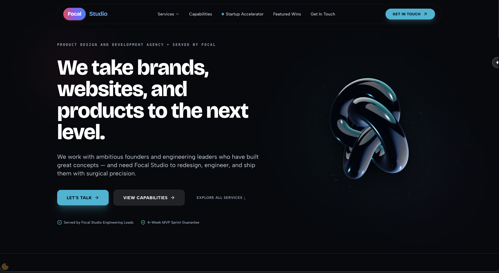

# ⚡ Focal Studio — Product Design Agency

[](https://nextjs.org/)
[](https://react.dev/)
[](https://tailwindcss.com/)
[](https://threejs.org/)
[](https://lenis.darkroom.engineering/)

A high-performance, ultra-luxurious agency web application for **Focal Studio** — architected with Next.js 14, React, Three.js WebGL graphics, Lenis inertia smooth scrolling, and GSAP animation triggers.

---

## 📸 Website Preview



---

## ✨ Key Features

- **🔮 Procedural 3D WebGL Cyber Orb**: Custom Three.js interactive model featuring a liquid glass outer shell, glowing inner core, dual orbital rings, and an ambient floating star particle field ([Metallic3DModel.jsx](components/Metallic3DModel.jsx)).
- **⚡ Electric Cyan & Deep Azure Color System**: High-contrast dark mode palette (`#07090e`) with vibrant cyan accent glows (`#00f2fe` / `#06b6d4`).
- **🌊 Lenis Inertia Smooth Scrolling**: Buttery-smooth wheel scrolling momentum eliminating default browser scroll stutter ([SmoothScroll.jsx](components/SmoothScroll.jsx)).
- **🎬 GSAP ScrollTrigger Animations**: Staggered scroll entrance reveals for headers, capabilities cards, client wins, and startup sprint blocks ([ScrollReveal.jsx](components/ScrollReveal.jsx)).
- **📝 Interactive Project Estimator Modal**: Executive 3-step intake form with budget brackets, capabilities selection, timeline windows, and NDA confidentiality assurances ([ProjectEstimatorModal.jsx](components/ProjectEstimatorModal.jsx)).
- **🗺️ Services Mega Menu**: Categorized full-service overlay menu with navigation anchors to all key sections ([ServicesMegaMenu.jsx](components/ServicesMegaMenu.jsx)).
- **♾️ Continuous Dual-Direction Tech Marquee**: Infinite looping tech ticker showcasing modern frontend, mobile, AI, and cloud stacks ([TechStackSection.jsx](components/TechStackSection.jsx)).

---

## 🛠️ Technology Stack

| Layer | Technology |
| :--- | :--- |
| **Framework** | Next.js 14 (App Router) |
| **UI Library** | React 18 |
| **Styling** | Tailwind CSS + Custom CSS Variables |
| **3D Graphics** | Three.js (WebGL + Canvas Environment Maps) |
| **Animations** | GSAP (GreenSock) + @gsap/react |
| **Smooth Scroll** | Lenis Momentum Scroll |
| **Icons** | Lucide React |

---

## 📁 Repository Structure

```
.
├── app/
│   ├── globals.css              # Design tokens & marquee keyframes
│   ├── layout.jsx               # Root layout & meta tags
│   └── page.jsx                 # Main application page component
├── components/
│   ├── CustomCursor.jsx         # GSAP monochrome custom cursor
│   ├── FocalLogo.jsx            # Brand pill logo component
│   ├── Footer.jsx               # Footer link grid & direct contact
│   ├── HeroSection.jsx          # Hero section with 3D Cyber Orb
│   ├── ClientWinsSection.jsx    # Featured client wins & logo grid
│   ├── Metallic3DModel.jsx      # Three.js WebGL 3D Cyber Orb
│   ├── Navbar.jsx               # Floating header navigation bar
│   ├── ProcessSection.jsx       # 4-stage process ("Launch", "Evolve", "Rebrand", "Extend")
│   ├── ProjectEstimatorModal.jsx# Multi-step "Get In Touch" intake modal
│   ├── ScrollReveal.jsx         # GSAP ScrollTrigger reveal wrapper
│   ├── ServicesMegaMenu.jsx     # Overlay full services menu
│   ├── ServicesSection.jsx      # Capabilities & services 4-card grid
│   ├── SmoothScroll.jsx         # Lenis smooth scrolling provider
│   ├── StartupSection.jsx       # 4-Week MVP sprint accelerator
│   └── TechStackSection.jsx     # Modern architecture marquee ticker & trust bar
└── public/
    └── preview.png              # Website preview image
```

---

## 🚀 Getting Started

### Prerequisites
Make sure you have **Node.js 18+** installed on your system.

### 1. Clone the Repository
```bash
git clone https://github.com/your-username/focal-studio-website.git
cd focal-studio-website
```

### 2. Install Dependencies
```bash
npm install
```

### 3. Run Development Server
```bash
npm run dev
```
Open [http://localhost:3000](http://localhost:3000) in your browser to view the live site.

### 4. Build for Production
```bash
npm run build
```

---

## 🔒 License & Ownership

© 2026 **Focal Studio**. All rights reserved. Architected and served by Focal Studio Engineering Leads.
